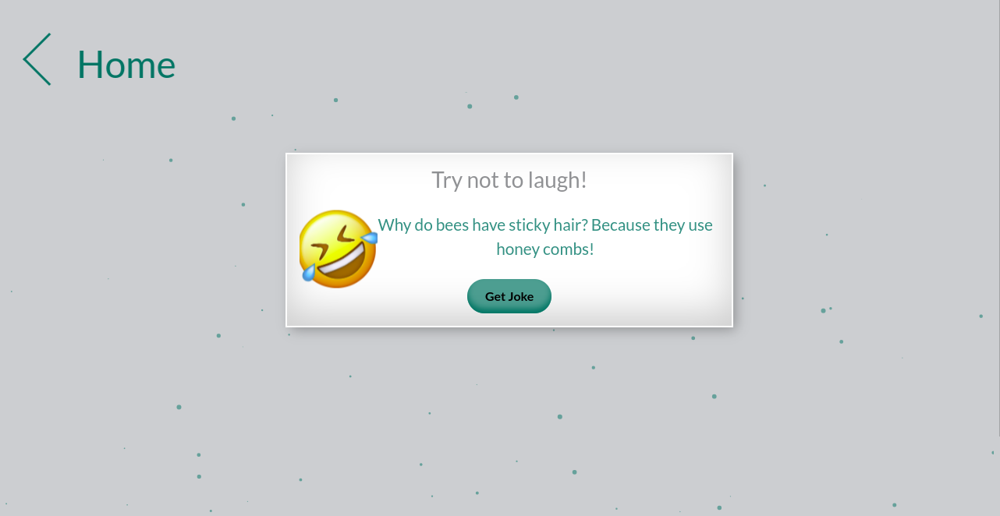

# [Toa Stress](https://miss-faith.github.io/Toa-stress/)
A stress Management web application.
#### By
[Faith Mwangi](https://github.com/miss-faith) , 
[Kelvin Mburu](https://github.com/kelvinmburu)  
[Ann Omao](https://github.com/annomao) , 
[Vincent Gichohi](https://github.com/VincentGichohi)
## Description
**Toa Stress** is a web application that seeks to assist individuals with better stress and anxiety management practices, by leveraging technology and simple practices. Thus allowing for improved mental health, increased performance and a healthy work/study life balance. it features:  
* **Meditation page** - Meditate in the app and listen to relaxing  music.
* **Break Out Game** - Play game using the computer keyboard control keys.
* **Dad Jokes** - Generate as many random jokes as the user deems fit for chilling and relaxation.

## Site
### Landing page
[Landing Page](https://miss-faith.github.io/Toa-stress/)

### Meditate page
[Mediate Page](https://miss-faith.github.io/Toa-stress/meditation.html)

### Dad Jokes page
[Mediate Page](https://miss-faith.github.io/Toa-stress/jokes.html)

### Setup Requirements
The project does not require any installations. To view the site:
* Have internet access on your electronic device
* Click the demo link provided above. Supported browsers include: Chrome, Firefox, Safari and Microsoft Edge.
## Technology Used
### Languages
* **HTML** - Used to build the webpage structure
* **CSS** - Used to style the webpage
* **JavaScript** - Used to develop the interactive application of the site and perform internal calculations
### Frameworks & Apis
* **Bootstrap** - Used to design and customize a responsive site
* **jquery** - Used to traverse and manipulate HTML document
* **Particles.js** - Used to make pages more interactive

## Want to contribute? Great!
To fix a bug or enhance an existing module, follow these steps:
* Fork the repo
* Create a new branch ('git checkout -b improve-feature')
* Make the appropriate changes in the files
* Add changes to reflect the changes made
* Commit your changes ('git commit -am 'Improve feature')
* Push to the branch ('git push origin improve-feature')
* Create a Pull Request
## Bug / Feature Request
If you find a bug/error, kindly open an issue [here](https://github.com/miss-faith/Toa-stress/issues/new)
Include your search query and the expected result.

If you'd like to request a new function, feel free to do so by opening an issue [here](https://github.com/miss-faith/Toa-stress/issues/new)
Include sample queries and their corresponding results.
## To-Do
- Connect with Spotify/Apple Music API for user selection music choice
- Moringa school app intergration
- Add breakout game to be functional in touch screen mobiles

## Contact information
[Faith Mwangi](faith.mwangi@student.moringaschool.com) , 
[Kelvin Mburu](mburuhkelvin@gmail.com) , 
[Ann Kerubo](omaokerubo21@gmail.com) , 
[Vincent Gichohi]()

## License
MIT License
Copyright (c) 2022 **Faith Mwangi**
